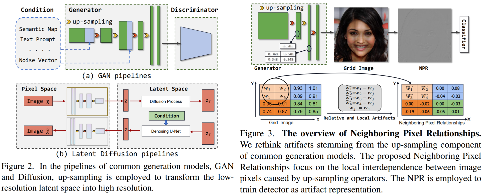

# Rethinking the Up-Sampling Operations in CNN-based Generative Network for Generalizable Deepfake Detection



Reference github repository for the paper [Rethinking the Up-Sampling Operations in CNN-based Generative Network for Generalizable Deepfake Detection](https://arxiv.org/abs/2312.10461).
```
@misc{tan2023rethinking,
      title={Rethinking the Up-Sampling Operations in CNN-based Generative Network for Generalizable Deepfake Detection}, 
      author={Chuangchuang Tan and Huan Liu and Yao Zhao and Shikui Wei and Guanghua Gu and Ping Liu and Yunchao Wei},
      year={2023},
      eprint={2312.10461},
      archivePrefix={arXiv},
      primaryClass={cs.CV}
}
```

## Environment setup
**Classification environment:** 
We recommend installing the required packages by running the command:
```sh
pip install -r requirements.txt
```
In order to ensure the reproducibility of the results, we provide the following suggestions：
- Docker image: nvcr.io/nvidia/tensorflow:21.02-tf1-py3
- Conda environment: [./pytorch18/bin/python](https://drive.google.com/file/d/16MK7KnPebBZx5yeN6jqJ49k7VWbEYQPr/view) 
- Random seed during testing period: [Random seed](https://github.com/chuangchuangtan/NPR-DeepfakeDetection/blob/b4e1bfa59ec58542ab5b1e78a3b75b54df67f3b8/test.py#L14)

Either one of the docker enviroment or conda environment can be adapted. I have adapted to conda environment.

## Getting the data
<!-- 
Download dataset from [CNNDetection CVPR2020 (Table1 results)](https://github.com/peterwang512/CNNDetection), [GANGen-Detection (Table2 results)](https://github.com/chuangchuangtan/GANGen-Detection) ([googledrive](https://drive.google.com/drive/folders/11E0Knf9J1qlv2UuTnJSOFUjIIi90czSj?usp=sharing)), [UniversalFakeDetect CVPR2023](https://github.com/Yuheng-Li/UniversalFakeDetect) ([googledrive](https://drive.google.com/drive/folders/1nkCXClC7kFM01_fqmLrVNtnOYEFPtWO-?usp=drive_link)), [DIRE 2023ICCV](https://github.com/ZhendongWang6/DIRE) ([googledrive](https://drive.google.com/drive/folders/1jZE4hg6SxRvKaPYO_yyMeJN_DOcqGMEf?usp=sharing)), Diffusion1kStep [googledrive](https://drive.google.com/drive/folders/14f0vApTLiukiPvIHukHDzLujrvJpDpRq?usp=sharing).
-->
|                        | paper  | Url  |
|:----------------------:|:-----:|:-----:|
| Train set              | [CNNDetection CVPR2020](https://github.com/PeterWang512/CNNDetection)                   | [Baidudrive](https://pan.baidu.com/s/1l-rXoVhoc8xJDl20Cdwy4Q?pwd=ft8b)                 | 
| Val   set              | [CNNDetection CVPR2020](https://github.com/PeterWang512/CNNDetection)                   | [Baidudrive](https://pan.baidu.com/s/1l-rXoVhoc8xJDl20Cdwy4Q?pwd=ft8b)                 | 
| Table1 Test            | [CNNDetection CVPR2020](https://github.com/PeterWang512/CNNDetection)                   | [Baidudrive](https://pan.baidu.com/s/1l-rXoVhoc8xJDl20Cdwy4Q?pwd=ft8b)                 | 
| Table2 Test            | [FreqNet AAAI2024](https://github.com/chuangchuangtan/FreqNet-DeepfakeDetection)        | [googledrive](https://drive.google.com/drive/folders/11E0Knf9J1qlv2UuTnJSOFUjIIi90czSj?usp=sharing)   | 
| Table3 Test            | [DIRE ICCV2023](https://github.com/ZhendongWang6/DIRE)                                  | [googledrive](https://drive.google.com/drive/folders/1jZE4hg6SxRvKaPYO_yyMeJN_DOcqGMEf?usp=sharing)   | 
| Table4 Test            | [UniversalFakeDetect CVPR2023](https://github.com/Yuheng-Li/UniversalFakeDetect)        | [googledrive](https://drive.google.com/drive/folders/1nkCXClC7kFM01_fqmLrVNtnOYEFPtWO-?usp=sharing)| 
| Table5 Test            | Diffusion1kStep                                                                         | [googledrive](https://drive.google.com/drive/folders/14f0vApTLiukiPvIHukHDzLujrvJpDpRq?usp=sharing)   | 

```
pip install gdown==4.7.1

chmod 777 ./download_dataset.sh

./download_dataset.sh
```
## Directory structure
<details>
<summary> Click to expand the folder tree structure. </summary>

```
datasets
|-- GANGen-Detection
|   |-- AttGAN
|   |-- BEGAN
|   |-- CramerGAN
|   |-- InfoMaxGAN
|   |-- MMDGAN
|   |-- RelGAN
|   |-- S3GAN
|   |-- SNGAN
|   `-- STGAN
|-- DiffusionForensics
|   |-- adm
|   |-- ddpm
|   |-- iddpm
|   |-- ldm
|   |-- pndm
|   |-- sdv1_new
|   |-- sdv2
|   `-- vqdiffusion
`-- UniversalFakeDetect
|   |-- dalle
|   |-- glide_100_10
|   |-- glide_100_27
|   |-- glide_50_27
|   |-- guided          # Also known as ADM.
|   |-- ldm_100
|   |-- ldm_200
|   `-- ldm_200_cfg
|-- Diffusion1kStep
    |-- DALLE
    |-- ddpm
    |-- guided-diffusion    # Also known as ADM.
    |-- improved-diffusion  # Also known as IDDPM.
    `-- midjourney

```
</details>

## Training the model 
```sh
python NPRDeepfakeDetect/train.py --name 4class-resnet-car-cat-chair-horse --dataroot NPRDeepfakeDetect/datasets/ForenSynths_train_val --classes car,cat,chair,horse --batch_size 32 --delr_freq 10 --lr 0.0002 --niter 50
```

## Testing the detector
Modify the dataroot in test.py.
```sh
python NPRDeepfakeDetect/test.py --model_path NPRDeepfakeDetect/model_epoch_last_3090.pth
```

## Detection Results

### [AIGCDetectBenchmark](https://drive.google.com/drive/folders/1p4ewuAo7d5LbNJ4cKyh10Xl9Fg2yoFOw) using [ProGAN-4class checkpoint](https://github.com/chuangchuangtan/NPR-DeepfakeDetection/blob/main/model_epoch_last_3090.pth)

When testing on AIGCDetectBenchmark, set no_resize and no_crop to True, and set batch_size to 1.

| Generator  | Acc. | A.P. |
|:----------:|:----:|:----:|
| AttGAN     | 92.5 | 98.6 |
| BEGAN      | 99.6 | 99.9 |
| CramerGAN  | 98.5 | 98.3 |
| InfoMaxGAN | 91.5 | 97.2 |
| MMDGAN     | 98.5 | 98.3 |
| RelGAN     | 99.8 | 100.0|
| S3GAN      | 79.8 | 78.9 |
| SNGAN      | 93.3 | 97.3 |
| STGAN      | 99.6 | 100.0|
| MEAN       | 94.8 | 96.5 |

| Generator     | Acc. | A.P. |
|:-------------:|:----:|:----:|
| DALLE         | 90.9 | 98.1 |
| GLIDE_100_10  | 97.8 | 99.5 |
| GLIDE_100_27  | 97.4 | 99.5 |
| GLIDE_50_27   | 97.5 | 99.5 |
| GUIDED        | 74.0 | 78.1 |
| LDM_100       | 98.0 | 99.6 |
| LDM_200       | 98.2 | 99.6 |
| LDM_200_cfg   | 98.0 | 99.5 |
| MEAN          | 93.9 | 96.7 |

## Acknowledgments

- This repository borrows partially from the [CNNDetection](https://github.com/peterwang512/CNNDetection).
- This repository borrows majorly from the [NPR-DeepfakeDetection](https://github.com/chuangchuangtan/NPR-DeepfakeDetection)

